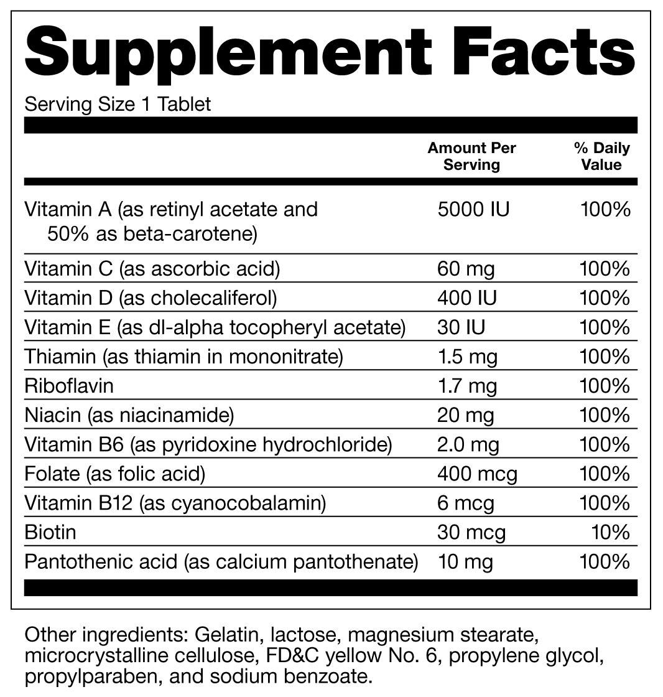
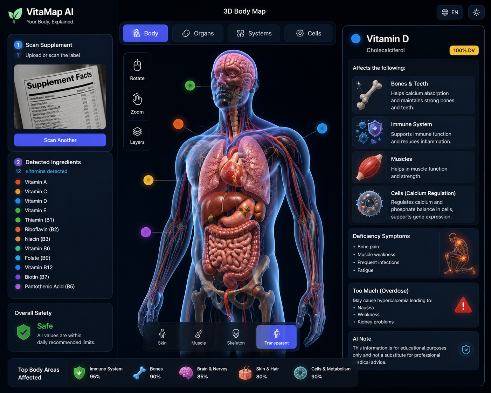

# VitaMap AI

**VitaMap AI** is an AI-powered concept that transforms a supplement label into an interactive **3D human body visualization**.

The goal is simple: help users understand how vitamins and nutrients relate to body parts, organs, systems, and cellular functions in a clear, visual, and educational way.

---

##  Concept

Many people read supplement labels without fully understanding what each vitamin does, where it acts in the body, or what safety considerations may apply.

VitaMap AI converts a static Supplement Facts label into an interactive learning experience:

```text
User uploads supplement label
        ↓
OCR extracts vitamins and dosage
        ↓
RAG retrieves trusted supplement knowledge
        ↓
AI generates structured insights
        ↓
3D body map visualizes the results
```

---

##  How It Works

1. **Scan or upload a supplement label**  
2. **Extract nutrients using OCR**  
3. **Retrieve trusted knowledge using RAG**  
4. **Analyze nutrients with AI**  
5. **Display the result in a 3D body interface**  

---


## Demo Preview

| Input: Supplement Label | Output: 3D Body Visualization |
|------------------------|------------------------------|
|  |  |
---

##  Key Features

- 3D visualization of supplement effects on:
  - Body parts
  - Organs
  - Biological systems
  - Cellular functions

- AI-assisted interpretation of detected vitamins
- RAG-based grounding using trusted nutrition sources
- Safety-oriented explanations, including deficiency and overdose awareness
- Simple language designed for non-expert users

---

##  Architecture

```text
Frontend: React + 3D UI
Backend: Node.js API
OCR: Tesseract
AI: Ollama / Llama
RAG: Trusted supplement knowledge retrieval
Output: Structured JSON + 3D visualization
```

---

##  Video Demo

https://www.youtube.com/watch?v=0inKRNMngcY

---

##  Expected Impact

VitaMap AI aims to:

- Improve supplement literacy
- Reduce exposure to misleading supplement claims
- Support safer supplement decisions
- Make nutrition information easier to understand for diverse audiences

---

##  Disclaimer

This project is for **educational purposes only**. It does not provide medical diagnosis, treatment, or personalized medical advice. Users should consult qualified healthcare professionals for medical decisions.
